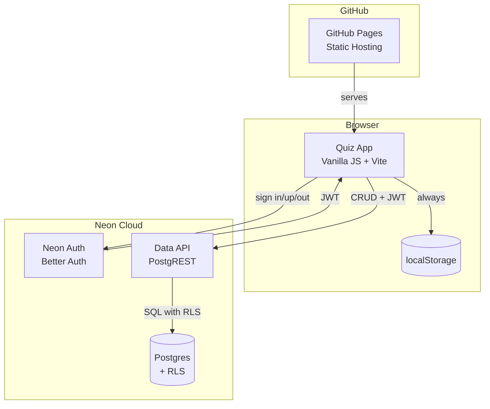
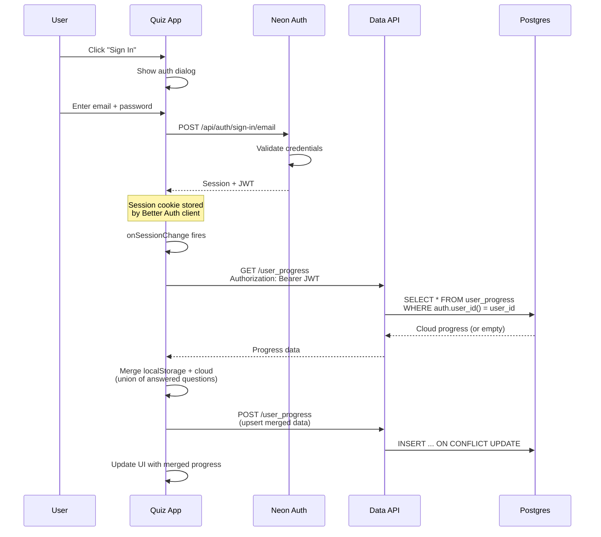
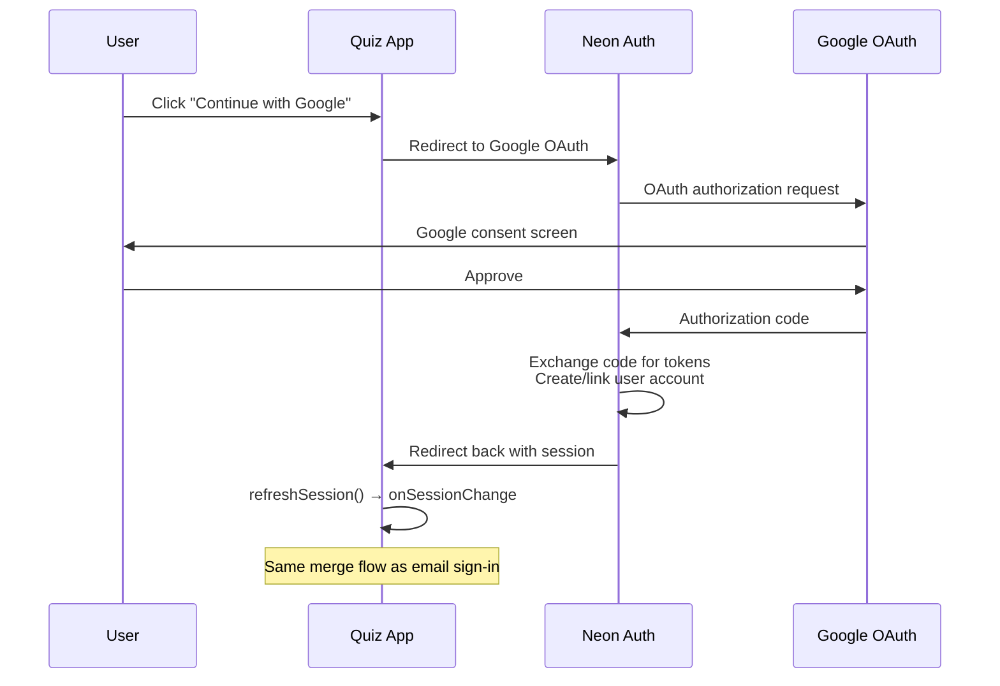
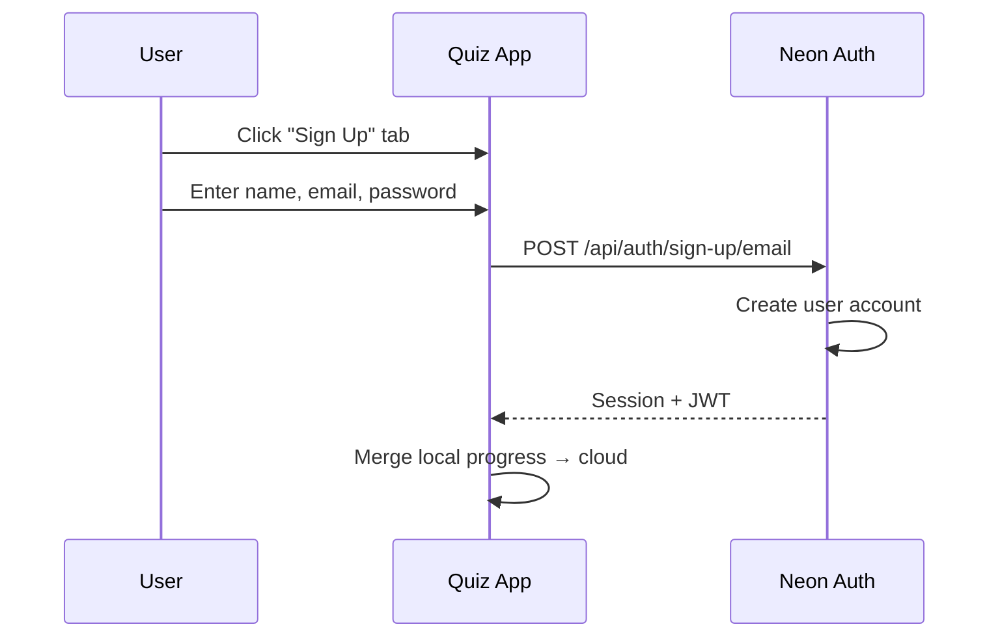
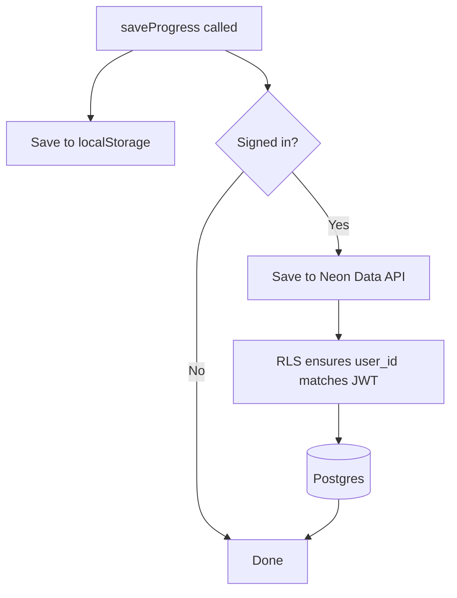
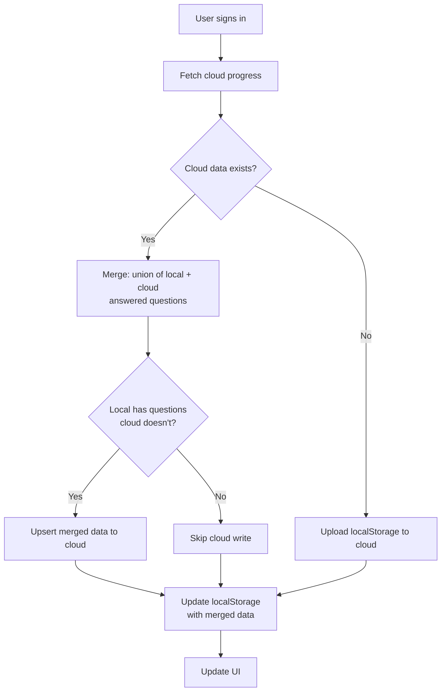
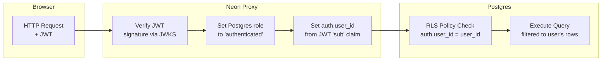
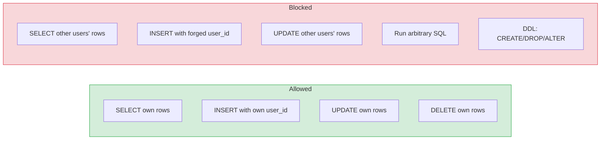
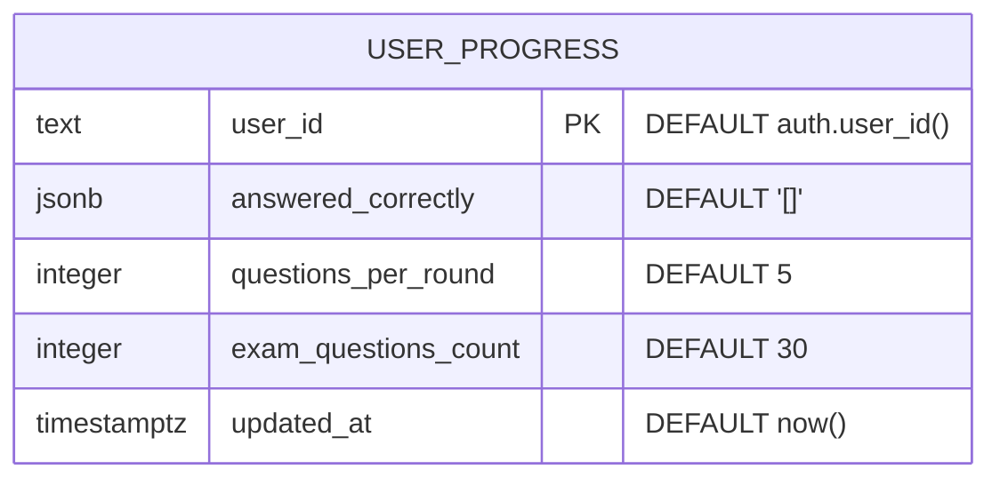
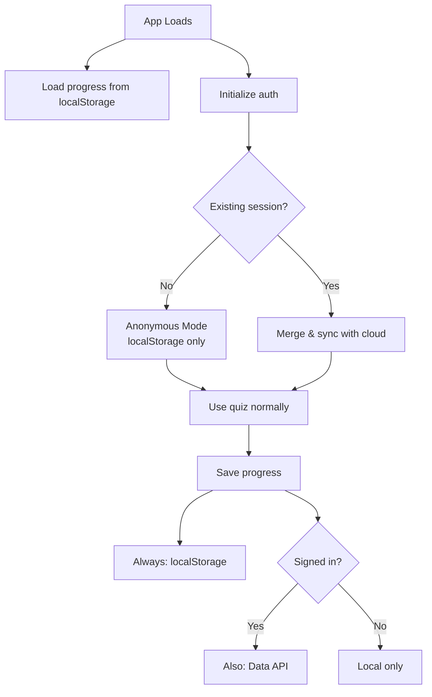

# Architecture: Authentication & Data Storage

## Overview

The Fencing Rules Quiz uses **Neon Auth** (Better Auth) for authentication and the **Neon Data API** (PostgREST) with **Row-Level Security (RLS)** for cloud data storage. There is no backend server — the browser communicates directly with Neon's hosted services.

Authentication is **optional**: anonymous users use localStorage, signed-in users get cloud sync.

## System Architecture

## Authentication Flow

### Sign In (Email + Password)

### Sign In (Google OAuth)

### Sign Up

## Data Storage

### Dual-Mode Persistence

### Progress Merge on Sign-In

## Data API Security Model

### Row-Level Security (RLS)

### What RLS Enforces

## Database Schema

The `user_id` column auto-populates from the JWT on INSERT — the client never sends it. This prevents user_id forgery.

## Anonymous vs. Signed-In Comparison

| Feature | Anonymous | Signed In |
|---|---|---|
| Quiz functionality | Full | Full |
| Progress storage | localStorage | localStorage + cloud |
| Cross-device sync | No | Yes |
| Data survives clearing browser | No | Yes |
| Requires network | No (after initial load) | For sync only |
